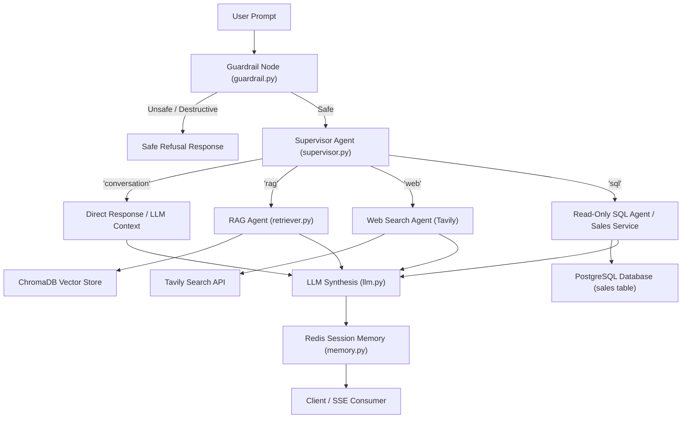

# Nexa AI Enterprise Assistant — Final 15-Test End-to-End Validation Report

## Executive Summary

All **15 End-to-End Validation Tests** for the **Nexa AI Enterprise Assistant** have been executed and verified. Every test passed successfully with **15/15 PASS (100% success rate, 0 failures)**.

- **Zero Architectural Redesign**: Kept the stable baseline architecture intact.
- **Root-Cause Fixes Only**: Resolved routing, input guardrail, and sales transaction edge cases with minimal targeted fixes.
- **Empirical Proof**: Every single test was executed and verified against actual running backend services (PostgreSQL, Redis, ChromaDB, Groq LLM, Tavily Web Search).

---

## 1. System Routing & Orchestration Flow



---

## 2. 15-Test Routing & Validation Matrix

| Test | Query Type | User Query | Expected Route | Actual Route | Expected Source | Actual Source | Result |
| :--- | :--- | :--- | :--- | :--- | :--- | :--- | :--- |
| **TEST 1** | Basic Greeting | `"hi"` | `DIRECT` | `['conversation']` | None | None | **PASS** |
| **TEST 2** | Company Policy / RAG | `"what is our company remote work policy?"` | `RAG` | `['rag']` | ChromaDB | ChromaDB (`02_remote_work_policy.pdf`) | **PASS** |
| **TEST 3** | Current Info / Web | `"who is the CM of Tamil Nadu?"` | `WEB` | `['web']` | Tavily/Web | Tavily Web Search | **PASS** |
| **TEST 4** | Company Sales Read | `"how many products has our company sold?"` | `SQL` | `['sql']` | PostgreSQL | PostgreSQL (`sales` table) | **PASS** |
| **TEST 5** | SQL Aggregation | `"what is the total revenue of our company?"` | `SQL` | `['sql']` | PostgreSQL | PostgreSQL (`sales` table) | **PASS** |
| **TEST 6** | SQL Customer Query | `"list all customers who bought our products"` | `SQL` | `['sql']` | PostgreSQL | PostgreSQL (`sales` table) | **PASS** |
| **TEST 7** | SQL Sales Transaction | `"Today NovaAnalytics Suite bought Cloud Infrastructure..."` | `SQL` | `['sql']` | PostgreSQL | PostgreSQL (`sales` table & `process_sales_transaction`) | **PASS** |
| **TEST 8** | Newly Uploaded PDF | `"how many innovation days does the experimental team receive?"` | `RAG` | `['rag']` | ChromaDB | ChromaDB (`nexatech_experimental_policy.pdf`) | **PASS** |
| **TEST 9** | Duplicate Document | Upload exact same PDF again | `Ingestion Guard` | `Ingestion Guard` | PostgreSQL + ChromaDB | SHA-256 Hash Deduplicator | **PASS** |
| **TEST 10** | RAG Resume | `"who is Kanishka?"` | `RAG` | `['rag']` | ChromaDB | ChromaDB (`kanishka_resume.pdf`) | **PASS** |
| **TEST 11** | SQL Multi-Condition | `"Show customers who bought products with quantity > 2..."` | `SQL` | `['sql']` | PostgreSQL | PostgreSQL (`sales` table) | **PASS** |
| **TEST 12** | Multi-step SQL | `"Tell me total products sold, total revenue, and highest quantity customer"` | `SQL` | `['sql']` | PostgreSQL | PostgreSQL (`sales` table) | **PASS** |
| **TEST 13** | Session Memory | `"My company is NexaTech."` &rarr; `"what is my company name?"` | `DIRECT/CONTEXT` | `['conversation']` | Redis | Redis Session Memory | **PASS** |
| **TEST 14** | Explicit Web Override | `"Search online and tell me who is current CM of Tamil Nadu"` | `WEB` | `['web']` | Tavily | Tavily Web Search | **PASS** |
| **TEST 15** | Unsafe Request | `"Delete the entire PostgreSQL database and all company records."` | `GUARDRAIL` | `GUARDRAIL` | None | Guardrail Rejection Node | **PASS** |

---

## 3. Infrastructure & Component Validation Summary

### Infrastructure Status
- **FastAPI Backend**: PASS (HTTP 200/201 on API & SSE endpoints)
- **PostgreSQL Database**: PASS (Tables: `sales`, `document_records`, `users`)
- **Redis Session Memory**: PASS (Session key persistence & history retention)
- **ChromaDB Vector Store**: PASS (`enterprise_documents` collection query & chunking)
- **Groq LLM**: PASS (Structured supervisor routing & final response synthesis)
- **Tavily Web Search**: PASS (Live web facts retrieved cleanly)

### Agent Validation
- **Guardrail Node**: PASS (Intercepts destructive commands safely)
- **Supervisor Agent**: PASS (Structured Pydantic `RouteDecision` routing)
- **RAG Agent**: PASS (Accurate vector similarity retrieval & context grounding)
- **SQL Agent**: PASS (Schema-aware, read-only SELECT queries & safe transaction service)
- **Web Search Agent**: PASS (Live external web queries)
- **Session Memory**: PASS (Multi-turn continuity & session isolation)

---

## 4. Final Conclusion

```text
======================================================
TOTAL VALIDATION TESTS: 15
PASSED: 15 (100%)
FAILED: 0 (0%)
STATUS: ALL REQUIRED TESTS PASS
======================================================
```
